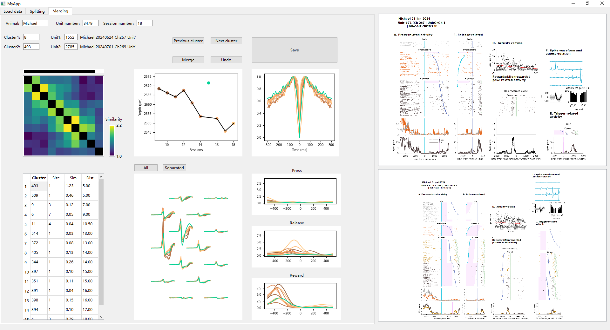

# DANT Curation App
[](https://github.com/jiumao2/DANT_UI)
Language：[English](./README.md) | [中文](./README_CN.md)

## Installation

1. Use a new conda environment:

```bash
conda create -n dant python=3.10.6
conda activate dant
```

2. Download the code: https://github.com/jiumao2/DANT_UI

3. Enter the code directory and install dependencies:

```bash
cd DANT_UI
pip install -r requirements.txt
```

## Running

1. Prepare the data files (SSD recommended), the folder should be in the following format:

```plaintext
├── DANT_Curation
    ├── ACG.npy
    ├── channel_locations.npy
    ├── Channels.npy
    ├── ClusterMatrixRaw.npy
    ├── IdxClustersRaw.npy
    ├── locations.npy
    ├── NumInChannels.npy
    ├── peth.npy
    ├── session_index.npy
    ├── SimilarityMatrix.npy
    ├── waveforms_corrected.npy
    ├── sort_index.npy
    ├── Meta.csv
    └── session_names.csv
└── PETH_Figs
    ├── Animal_Session_Ch1_Unit1.png
    ├── Animal_Session_Ch1_Unit2.png
    ├── ...
```

2. Enter the code directory and run:

```bash
python myapp.py
```

3. Enter the first tab, select the data folder, and then click `Load Data` button to load the data (this may take some time).


4. After loading is complete, it automatically enters the second `Splitting` tab. The logic of the check is to first check whether there are incorrectly clustered results within each cluster and split them. Finally, in the third `Merging` tab, merge the same Clusters.

5. Click the `Save` button to save the current results. The current results will be stored in the `DANT_Curation/IdxClusters.npy` file and will be automatically read the next time the data is loaded.

## Splitting Tab Instructions


1. The upper left corner displays some meta information, including the neurons (Unit1 and Unit2) selected for the PETH images on the right.

2. The left side shows the Similarity Matrix heatmap, displaying the similarity between neurons within the current Cluster. This similarity is obtained by DANT, mainly referencing the similarity of Waveforms, and to a lesser extent, the similarity of ACG. Clicking on a position in the heatmap allows you to select the corresponding two neurons, and their PETH and Waveform comparison charts will be displayed on the right. Clicking the diagonal allows you to select individual neurons, and then clicking the "Select units" button above the Waveform chart can display comparisons between these neurons and others.

3. The middle section includes some information about the neurons, such as their positions on the electrode, Waveform, ACG, and PETH.

4. Left-clicking the diagonal of the heatmap allows you to select neurons to be split, which will be displayed in the "Units to split" section above. Clicking the `Split` button will change the Cluster ID of these neurons to a new ID, while the Cluster IDs of the remaining neurons remain unchanged. Clicking the `Undo` button can undo the last split operation (undoing earlier operations is not possible).

5. Click the `Previous` and `Next` Cluster buttons to switch to the previous or next Cluster for inspection and splitting.

## Merging Tab Instructions



1. The upper left corner displays some meta information, including the neurons (Unit1 and Unit2) selected for the PETH images on the right. `Cluster1` is the currently selected Cluster, and `Cluster2` is a Cluster similar to `Cluster1`, possibly requiring merging.

2. The left side shows the Similarity Matrix heatmap, displaying the similarity between neurons within the current `Cluster1` and `Cluster2` (as above). The black lines above the heatmap indicate the Units of `Cluster1`.

3. The lower left shows a list of the 15 Clusters most similar to `Cluster1`. Clicking on a row allows you to select that Cluster as `Cluster2` for comparison. Size indicates the number of Units contained in that Cluster, Sim indicates the average similarity between Units of the two Clusters, and Distance indicates the distance between the centers of the two Clusters (obtained by sorting Units with HDBSCAN).

4. The images on the right are similar to those in the `Splitting` tab, showing the Waveform, ACG, and PETH of neurons in `Cluster1` and `Cluster2`. Units of `Cluster1` are displayed using the Copper colormap, and Units of `Cluster2` are displayed using the Winter colormap.

5. Clicking the `Merge` button will change the Cluster ID of all neurons in `Cluster2` to that of `Cluster1`. Clicking the `Undo` button can undo the last merge operation (undoing earlier operations is not possible).

6. Click the `Previous` and `Next` buttons to switch to the previous or next cluster for inspection and merging.
