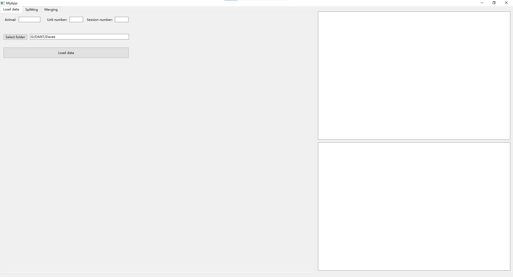
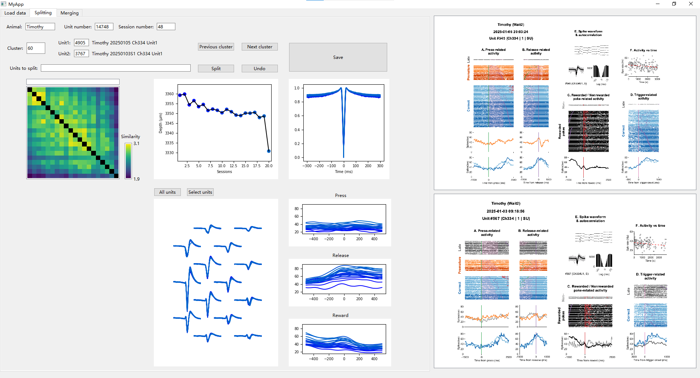

# DANT Curation App

## 安装

1. 使用新的conda环境：

```bash
conda create -n dant python=3.10.6
conda activate dant
```

2. 下载代码：https://github.com/jiumao2/DANT_UI
3. 进入代码目录，安装依赖：

```bash
cd DANT_UI
pip install -r requirements.txt
```
## 运行

1. 准备数据文件（建议使用SSD），文件夹应为以下格式：

```plaintext
├── DANT_Curation
    ├── ACG.npy
    ├── channel_locations.npy
    ├── Channels.npy
    ├── ClusterMatrixRaw.npy
    ├── IdxClustersRaw.npy
    ├── locations.npy
    ├── NumInChannels.npy
    ├── peth.npy
    ├── session_index.npy
    ├── SimilarityMatrix.npy
    ├── waveforms_corrected.npy
    ├── Meta.csv
    └── session_names.csv
└── PETH_Figs
    ├── Animal_Session_Ch1_Unit1.png
    ├── Animal_Session_Ch1_Unit2.png
    ├── ...
```

2. 进入代码目录，运行：

```bash
python myapp.py
```

3. 进入第一个界面，选择数据文件夹，然后点击“Load Data”加载数据（可能需要一段时间）。



4. 加载完成后，自动进入第二个Splitting界面。检查的逻辑是先检查每一个Cluster内是否有错误聚类的结果，将其拆分。最后在第三个Merging界面（尚未完成），将相同的Cluster合并。

## Splitting界面使用说明



1. 左上角显示一些元信息，并且包括右侧PETH图像选用的神经元（Unit1和Unit2）。

2. 左侧为Similarity Matrix热图，显示当前Cluster内各个神经元之间的相似度。该相似度由DANT得到，主要参考了Waveform的相似度，以及较小程度的ACG相似度。点击热图中的某个位置，可以选择对应的两个神经元，右侧会显示它们的PETH和Waveform对比图。点击对角线可以选择单独的某些神经元，再点击Waveform图上方的“Select units”按钮可以显示这些神经元与其他神经元的对比。

3. 中间包括了神经元的一些信息，比如在电极上的位置，Waveform，ACG以及PETH。

4. 左键热图的对角线可以选择准备进行拆分的神经元，会在上方Units to split中显示。点击Split按钮后这些神经元的Cluster ID会被修改为新的ID，而剩下的神经元Cluster ID不变。点击Undo按钮可以撤销上一次拆分操作（无法撤销上上次的操作）。

5. 点击Previous Cluster和Next Cluster按钮可以切换到上一个或下一个Cluster进行检查和拆分。

6. 点击Save按钮保存当前结果。当前结果会被存储在`DANT_Curation/IdxClusters.npy`文件中并在下一次加载数据时被自动读取。